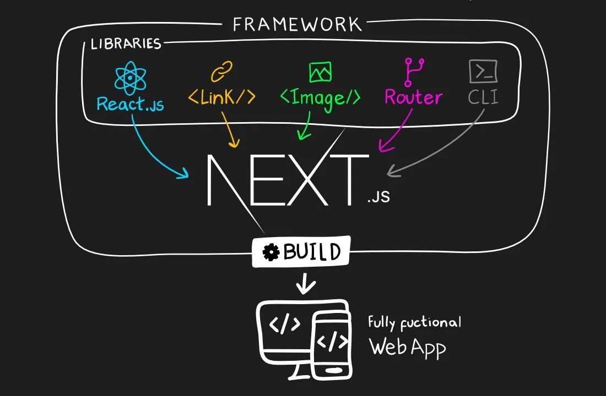

<i>Source: https://miro.medium.com/v2/resize:fit:720/format:webp/1*paa_fE-5pH-DlR0_uA6QyQ.jpeg</i>
# What is Next.js
Next.js is a <strong>React-based web development framework</strong> built by Vercel. It has built-in features that support both frontend (client/browser) and backend (web server) web application development. 

## Features
- Server-Side Rendering
- Static Site Generation  
- Fetch and Component Caching
- Dynamic HTML Streaming
- API Routing
- File-based Routing
- Automatic Image, Font and Script optimization
- Server actions

## Development environment setup
### Install Node.js
Windows
```powershell
winget install
```

### Check 
